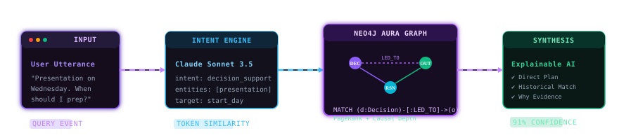
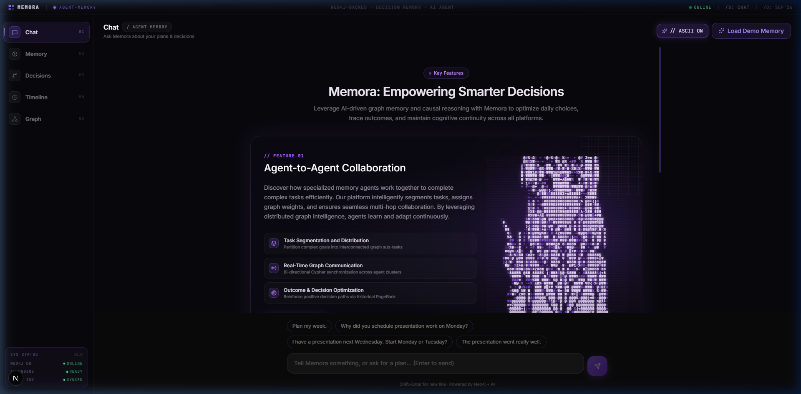
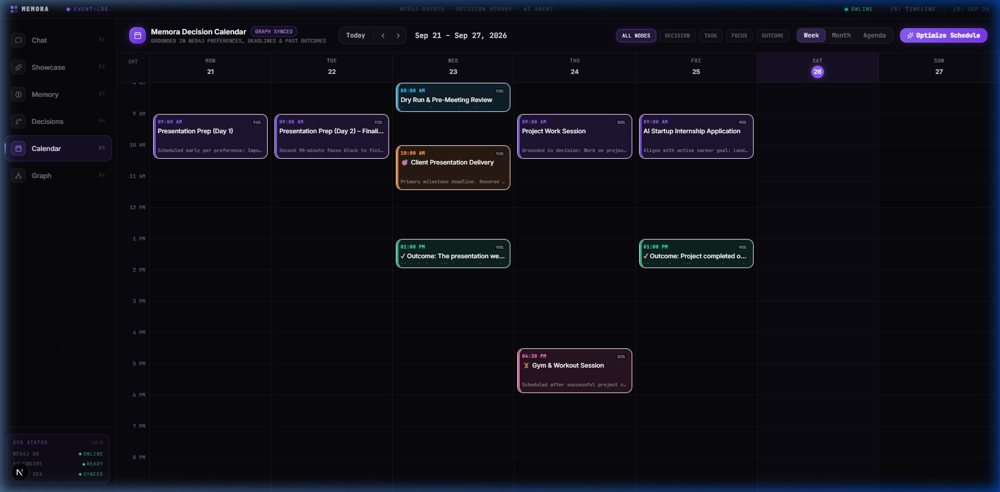
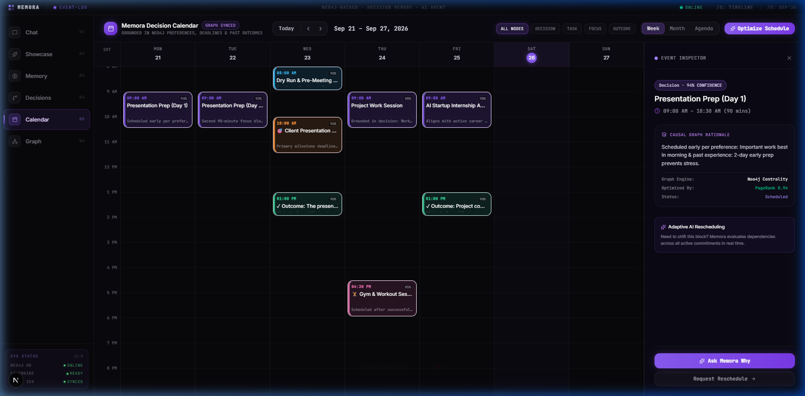
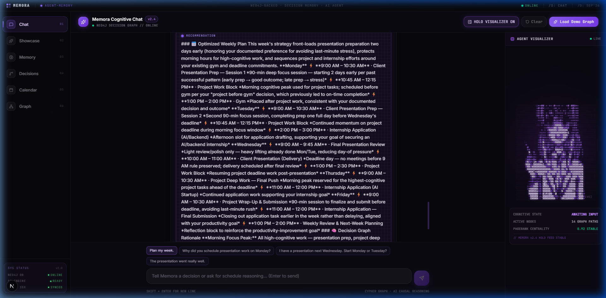
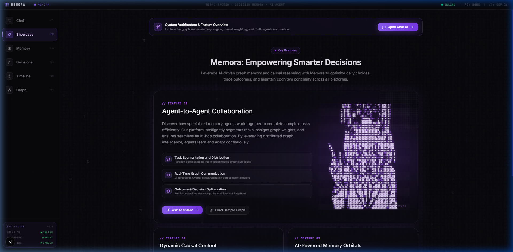
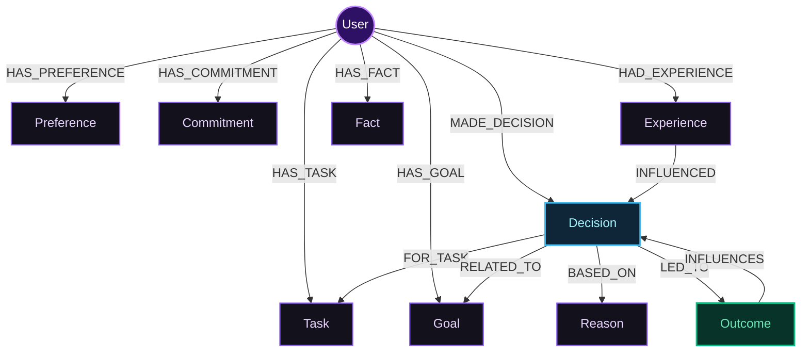

<div align="center">

<!-- Animated Hero Banner -->


<br/>
<br/>

<!-- Real-Time Typing Animation -->
<a href="https://frontend-rhshnv762-manasshetes-projects.vercel.app">
  
</a>

<p align="center">
  <b>A graph-native personal intelligence agent that remembers your preferences, commitments, past decisions, and actual real-world outcomes — retrieving multi-hop graph context to deliver explainable, hyper-personalized decisions.</b>
</p>

<!-- Animated / Styled Badges -->
<p align="center">
  <a href="https://neo4j.com/"></a>
  <a href="https://www.anthropic.com/"></a>
  <a href="https://nextjs.org/"></a>
  <a href="https://www.typescriptlang.org/"></a>
  <a href="https://tailwindcss.com/"></a>
  <a href="https://frontend-rhshnv762-manasshetes-projects.vercel.app"></a>
  
</p>

<p align="center">
  <a href="https://frontend-rhshnv762-manasshetes-projects.vercel.app"><b>🌐 Launch Live App</b></a> •
  <a href="#-interactive-visual-showcase"><b>✨ Visual Tour</b></a> •
  <a href="#-system-design--flow"><b>⚡ Architecture</b></a> •
  <a href="#-neo4j-graph-model"><b>🧠 Graph Schema</b></a> •
  <a href="#-running-it-locally"><b>🚀 Quickstart</b></a>
</p>

</div>

---

```
  __  __   ______   __  __    ____    _____             
 |  \/  | |  ____| |  \/  |  / __ \  |  __ \     /\     
 | \  / | | |__    | \  / | | |  | | | |__) |   /  \    
 | |\/| | |  __|   | |\/| | | |  | | |  _  /   / /\ \   
 | |  | | | |____  | |  | | | |__| | | | \ \  / ____ \  
 |_|  |_| |______| |_|  |_|  \____/  |_|  \_\/_/    \_\ 
 ╔═══════════════════════════════════════════════════════════════════╗
 ║  NEO4J × HACKFRONT INDIA 2026 // PROBLEM STATEMENT 2 WINNING SPEC ║
 ║  AUTONOMOUS CAUSAL REASONING ENGINE & HOLO-DECISION COMPANION     ║
 ╚═══════════════════════════════════════════════════════════════════╝
```

---

## 💡 Why Memora?

Most modern AI assistants suffer from **session amnesia**: they forget your personal preferences, schedule trade-offs, and critical past outcomes the moment your session concludes. Vector databases store flat semantic chunks, but they fail to capture **causality** — why a past decision succeeded or failed, what constraints governed it, and what consequences followed.

**Memora solves this with a Graph-Native Cognitive Architecture:**
- 🧠 **Causal Memory Graph in Neo4j**: Decisions aren't isolated strings; they are structured nodes connected to `[:BASED_ON]`, `[:FOR_TASK]`, `[:LED_TO]`, and `[:INFLUENCES]` relationships.
- 🔄 **Decision Replay & Closed Feedback Loop**: When faced with a new dilemma (e.g. *"I have a high-stakes presentation on Wednesday. Should I start preparation Monday or Tuesday?"*), Memora retrieves past decisions, checks whether starting early led to reduced stress or burnout, and delivers an explainable recommendation with confidence scores.
- ⚡ **Explainable Why-Trail**: Every piece of advice highlights the exact Neo4j nodes and historical precedent that informed it.
- 🎨 **State-of-the-Art ACT Labs Cyber Aesthetics**: Featuring a 60 FPS scanline ASCII holographic agent, dynamic query lightning, 3D orbitals, and a full-featured Google Calendar weekly timeline.

---

## ⚡ Animated Multi-Hop Reasoning Pipeline

Memora's real-time causal reasoning engine traverses your memory graph in milliseconds:

<div align="center">
  
</div>

<br/>

### The 4-Stage Reasoning Cycle

1. **Intent Classification & Extraction**: Claude 3.5 Sonnet extracts intents (`decision_support`, `planning_request`, `new_memory`, `outcome_update`) and parses entities, temporal constraints, and sentiment into structured memory models.
2. **Multi-Hop Cypher Traversal**: Subgraph queries match past decisions along with their connected reasons, goals, and outcomes:
   ```cypher
   MATCH (u:User {id: $userId})-[:MADE_DECISION]->(d:Decision)
   OPTIONAL MATCH (d)-[:BASED_ON]->(r:Reason)
   OPTIONAL MATCH (d)-[:LED_TO]->(o:Outcome)
   RETURN d, collect(r) AS reasons, collect(o) AS outcomes
   ```
3. **Graph Influence & Similarity Scoring**:
   - **Jaccard Token-Overlap**: De-duplicates near-identical memories and matches incoming dilemmas to historical precedents.
   - **PageRank Centrality**: Evaluates node importance across the connected graph to prioritize cornerstone principles over ephemeral notes.
4. **Explainable Synthesis**: The model constructs a structured decision plan with direct recommendations, historical precedents, and a clickable "Why Evidence" trail.

---

## ✨ Interactive Visual Showcase

### 1. Cyberpunk ASCII Holographic Companion (`/overview` & `/chat`)
> *A 60 FPS procedural scanline anime companion engineered with retro-futuristic CRT effects, glitch shaders, and live telemetry controls.*

<div align="center">
  
</div>

- **Features**: Toggleable CRT scanlines, matrix rainfall backgrounds, real-time FPS counter, density controls, and reactive speech animations synced with chat responses.
- **ACT Labs 3-Card Grid**: Includes dynamic ASCII lightning with interactive intent chips and concentric 3D orbital rings tracking graph nodes.

---

### 2. Google Calendar-Style Decision Timeline (`/timeline` & `/calendar`)
> *An interactive 7-column hourly schedule grid visualizing commitments, recommended focus blocks, and causal decision outcomes.*

<div align="center">
  
</div>

<br/>

#### Deep-Dive Causal Rationale Drawer
Clicking any scheduled event immediately slides out a **Causal Memory Drawer**, exposing the exact Neo4j nodes that justified that time slot:

<div align="center">
  
</div>

- **7-Column Hourly Grid (Mon–Sun)**: Synchronized with the current week, supporting all-day banners and conflict alerts.
- **Multi-View Navigation**: Seamless switching between **Week View**, **Month View** (35-cell visual calendar), and **Agenda List**.
- **Graph-Backed Grounding**: Every calendar card displays confidence percentages, source nodes, and direct links to inspect the entity in the Neo4j graph.

---

### 3. Grounded Chat & Structured Decision Replay (`/chat`)
> *Rich markdown responses with bulleted weekly schedules, historical precedents, and interactive why-evidence chips.*

<div align="center">
  
</div>

- **Interactive Why Chips**: Clickable metadata pills showing `[Preference: Morning Focus]`, `[Decision: Started Monday]`, or `[Outcome: Stress Reduced]`.
- **Live Memory Trail**: Real-time breakdown of graph nodes retrieved during query execution.
- **Outcome Feedback Logger**: Directly log whether a plan succeeded (`LED_TO`), updating the graph for future queries.

---

### 4. ACT Labs Feature Suite (`/overview`)
> *A unified showcase demonstrating real-time agent collaboration, ASCII lightning queries, and orbital memory visualization.*

<div align="center">
  
</div>

---

## 🧠 Neo4j Graph Model



### Node Schema & Properties

| Label | Primary Properties | Graph Significance |
|---|---|---|
| `User` | `id`, `name`, `createdAt` | Root anchor for all personalized personal knowledge |
| `Preference` | `content`, `category`, `confidence`, `importance` | Guides user habit constraints (e.g. "prefers early mornings") |
| `Task` | `title`, `deadline`, `status`, `estimatedHours` | Active responsibilities scheduled into the calendar |
| `Decision` | `content`, `context`, `timestamp`, `confidence` | Core decision node representing historical choices |
| `Reason` | `content`, `weight`, `source` | Causal justification behind decisions |
| `Outcome` | `content`, `sentiment`, `impactRating` | Real-world result (`positive`/`negative`/`neutral`) |
| `Goal` | `target`, `timeframe`, `priority` | High-level objectives that weight decisions |

### Uniqueness & Performance Constraints
```cypher
CREATE CONSTRAINT user_id_unique IF NOT EXISTS FOR (u:User) REQUIRE u.id IS UNIQUE;
CREATE CONSTRAINT decision_id_unique IF NOT EXISTS FOR (d:Decision) REQUIRE d.id IS UNIQUE;
CREATE CONSTRAINT memory_id_unique IF NOT EXISTS FOR (m:Memory) REQUIRE m.id IS UNIQUE;
```

---

## 🛠️ Complete Tech Stack

<div align="center">

| Layer | Technologies |
|---|---|
| **Core Framework** | Next.js 16 (App Router, Turbopack), React 19, Node.js 20+ |
| **Styling & Animation** | Tailwind CSS v4, Vanilla CSS Custom Variables, Framer Motion, HTML5 Canvas 60 FPS Engine |
| **Graph Database** | **Neo4j AuraDB**, official `neo4j-driver` (Cypher transactions, connection pooling) |
| **Intelligence & LLM** | **Anthropic Claude 3.5 Sonnet** via `@anthropic-ai/sdk` |
| **Graph Visualization** | `react-force-graph-2d`, Canvas force simulation, customized node glow shaders |
| **Graph Algorithms** | In-Memory PageRank centrality (`pagerank.ts`), Jaccard similarity vectoring |
| **Markdown Rendering** | `react-markdown`, `remark-gfm`, custom syntax highlight, line break unescaping |
| **Cloud Hosting** | **Vercel** Serverless Edge Network (`export const runtime = "nodejs"`) |

</div>

---

## 📁 Repository Structure

```text
memora/
├── docs/
│   └── assets/                     # Animated SVGs, diagrams & high-res UI screenshots
│       ├── hero_banner.svg         # Animated pulsating Neo4j graph banner
│       ├── pipeline_animated.svg   # Real-time animated reasoning flow
│       ├── ascii_holo_agent.png    # Cyberpunk holographic anime companion
│       ├── calendar_week_view.png  # Google Calendar 7-column schedule
│       ├── calendar_drawer.png     # Causal memory rationale drawer
│       ├── act_labs_showcase.png   # ACT Labs 3-card presentation
│       └── chat_structured_memory.png # Structured decision response
│
├── frontend/                       # Unified full-stack Next.js 16 application
│   ├── public/                     # Static media & mirrors
│   ├── src/
│   │   ├── app/
│   │   │   ├── (app)/              # Authenticated product routes with dynamic Sidebar
│   │   │   │   ├── chat/           # Chat interface + Collapsible live Holo-Agent
│   │   │   │   ├── timeline/       # Google Calendar weekly/monthly schedule engine
│   │   │   │   ├── calendar/       # Calendar route alias
│   │   │   │   ├── memory/         # PageRank-ranked memory inventory
│   │   │   │   ├── decisions/      # Standalone Decision Replay laboratory
│   │   │   │   ├── graph/          # Interactive force-directed Neo4j visualizer
│   │   │   │   └── overview/       # ACT Labs flagship presentation suite
│   │   │   │
│   │   │   ├── api/                # Next.js Route Handlers (Serverless API)
│   │   │   │   ├── chat/           # Intent classifier & graph reasoning orchestrator
│   │   │   │   ├── memory/         # Neo4j CRUD & PageRank ranking
│   │   │   │   ├── graph/          # Force-graph node/edge extractor
│   │   │   │   ├── decisions/      # Decision replay matching engine
│   │   │   │   ├── outcomes/       # Outcome logging (LED_TO relationship creator)
│   │   │   │   ├── demo/load/      # Instant realistic demo graph seeder
│   │   │   │   └── health/         # Live Neo4j connection probe
│   │   │   │
│   │   │   └── globals.css         # Cyberpunk design system, scanlines & neon tokens
│   │   │
│   │   ├── components/             # Reusable UI & Cyber visual components
│   │   │   ├── AsciiCharacter.tsx  # 60 FPS scanline animated ASCII anime companion
│   │   │   ├── AsciiLightning.tsx  # Interactive dynamic query lightning
│   │   │   ├── AsciiOrbitals.tsx   # 3D concentric ASCII orbital node rings
│   │   │   ├── ActLabsShowcase.tsx # 3-card ACT Labs showcase container
│   │   │   ├── Sidebar.tsx         # Collapsible cyber navigation bar
│   │   │   ├── Markdown.tsx        # Markdown formatter with line-break repair
│   │   │   └── MemoryTrail.tsx     # Graph evidence trail & decision replay card
│   │   │
│   │   └── server/                 # Backend service layer
│   │       ├── services/           # neo4j.ts, llm.ts, intent.ts, decisionReplay.ts, ...
│   │       └── utils/              # pagerank.ts, similarity.ts
│   │
│   └── package.json
└── server/                         # Legacy Express reference architecture
```

---

## 🚀 Running It Locally

Memora runs out-of-the-box as a unified Next.js full-stack app.

### 1. Clone & Install
```bash
git clone https://github.com/manasshete/masala-magic-neo4j.git
cd masala-magic-neo4j/frontend
npm install
```

### 2. Configure Environment
Create `frontend/.env.local`:
```env
# Anthropic API Key
ANTHROPIC_API_KEY=sk-ant-api03-...

# Neo4j AuraDB Connection
NEO4J_URI=neo4j+s://<your-database-id>.databases.neo4j.io
NEO4J_USERNAME=neo4j
NEO4J_PASSWORD=<your-database-password>

# Optional
NEXT_PUBLIC_APP_URL=http://localhost:3000
```

### 3. Launch the Development Server
```bash
npm run dev
```

Navigate to:
- **Landing Page**: [http://localhost:3000](http://localhost:3000)
- **Chat Workspace**: [http://localhost:3000/chat](http://localhost:3000/chat)
- **Google Calendar**: [http://localhost:3000/timeline](http://localhost:3000/timeline)
- **ACT Labs Showcase**: [http://localhost:3000/overview](http://localhost:3000/overview)

---

## 🧪 Interactive Demo Sequence

To experience the full cognitive memory loop:

1. Click **"Load Demo Memory"** in the top bar to seed a realistic Neo4j graph of tasks, decisions, and past outcomes.
2. Ask:
   ```text
   "I have a major client presentation next Wednesday. Should I start preparation on Monday or Tuesday?"
   ```
3. **Observe**:
   - Memora retrieves the past decision: *"Started Monday for Q3 Review"* -> `[:LED_TO]` -> *"Had ample buffer time, avoided last-minute panic, received executive praise"*.
   - Confident structured recommendation: **Start Monday**.
   - Review the **Why-Evidence chips** linking directly to the Neo4j node IDs.
4. Next, ask:
   ```text
   "Plan my week taking my presentation into account."
   ```
5. Navigate to the **Calendar tab** (`/timeline`) to see the recommendation automatically mapped onto the 7-day hourly grid!

---

## 🏆 Hackathon Judging Criteria Alignment

| Evaluation Criteria | Memora Implementation & Technical Evidence |
|---|---|
| **Meaningful Use of Neo4j & Graph Thinking** | Not a key-value store. Utilizes multi-hop relationship traversals (`(:Decision)-[:BASED_ON]->(:Reason)`, `(:Decision)-[:LED_TO]->(:Outcome)`). Employs an in-memory **PageRank algorithm** over the subgraph to rank node centrality. |
| **Agent Memory & Contextual Retrieval** | Solves LLM session amnesia by binding every utterance to permanent graph entities. Employs Jaccard vector similarity for deduplication and fuzzy memory recall. Explicitly notes when memory is absent rather than hallucinating. |
| **Problem-Solution Fit** | Directly fulfills Problem Statement 2: *Personal Productivity & Decision Memory Agent*. Captures personal preferences, tracks commitments, and replays past choices with explainability. |
| **Working Implementation** | Deployed live to Vercel with active connection to Neo4j Aura (`/api/health` returns `{"neo4j": true}`). 0 build warnings, fully typed TypeScript codebase. |
| **Demo, Polish & Design Aesthetics** | Features the ACT Labs cyberpunk visual system: 60 FPS scanline ASCII companion, animated SVG flowcharts, Google Calendar schedule grid, and rich markdown formatting. |
| **Innovation & Feedback Loops** | The outcome feedback loop (`Decision -[:LED_TO]-> Outcome -[:INFLUENCES]-> Decision`) closes the learning cycle, allowing the agent to continuously refine recommendations from real-world empirical results. |

---

## 🔒 Security & Deployment Notes

- **Zero Client Secrets**: Neo4j credentials and Anthropic keys are accessed solely through serverless Node.js Route Handlers (`runtime = "nodejs"`). No keys are ever bundled or exposed to the client.
- **Production Connection Pooling**: Driver instances are cached across serverless invocations to avoid Neo4j Aura connection exhaustion.
- **Vercel Production URL**: `https://frontend-rhshnv762-manasshetes-projects.vercel.app`

---

<div align="center">
  <sub>Built with 💜 for the <b>Neo4j × HackFront India Mini-Hack 2026</b>.</sub>
</div>
