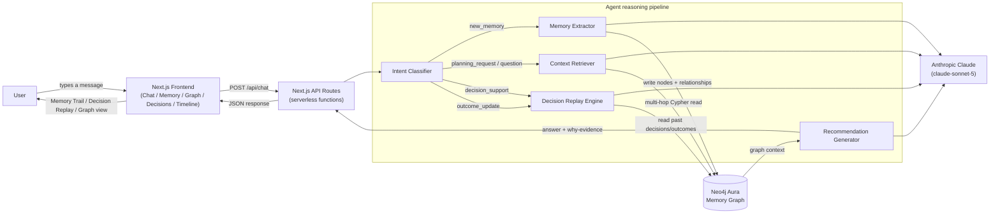
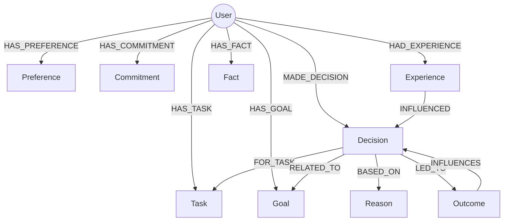
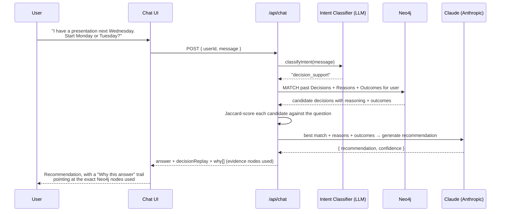

# Memora — Personal Productivity & Decision Memory Agent

Memora is an AI agent that remembers you. It stores your preferences, tasks, decisions, reasons, and outcomes as a real graph in **Neo4j**, then retrieves the relevant parts of that graph on every new interaction so its recommendations get sharper and more personal the more you use it.

Built for the **Neo4j × HackFront India Mini-Hack** — Problem Statement 2: *Personal Productivity & Decision Memory Agent*.

**Live demo:** `https://frontend-rhshnv762-manasshetes-projects.vercel.app`
**Repo:** `https://github.com/manasshete/masala-magic-neo4j`

---

## Table of contents

- [Why this exists](#why-this-exists)
- [System design](#system-design)
- [Neo4j graph model](#neo4j-graph-model)
- [Request flow — a single message](#request-flow--a-single-message)
- [Decision Replay — the flagship feature](#decision-replay--the-flagship-feature)
- [Tech stack](#tech-stack)
- [Project structure](#project-structure)
- [Running it locally](#running-it-locally)
- [Deployment](#deployment)
- [App tour](#app-tour)
- [Judging-criteria mapping](#judging-criteria-mapping)

---

## Why this exists

Most AI chat assistants forget everything the moment the conversation ends. Memora is the opposite: every preference, task, decision, and outcome you mention becomes a **node** in a Neo4j graph, connected by typed relationships to the reasoning and results behind it. When you come back and ask "plan my week" or "should I do X again", Memora doesn't just answer from the current message — it walks its own memory graph first, and shows you exactly which nodes it used and why.

---

## System design



The whole app is a **single Next.js deployment on Vercel**. The chat UI, the memory dashboards, and the backend logic (previously a separate Express server) now live in one codebase — Next.js Route Handlers under `frontend/src/app/api/*` replace the old Express routes, all calling into the same service layer (`frontend/src/server/services/*`) that talks to Neo4j and Claude.

---

## Neo4j graph model



Every node carries `id`, `userId`, `content`, `confidence`, `importance`, `status`, `source`, `createdAt`/`updatedAt`. Uniqueness constraints (`CREATE CONSTRAINT ... REQUIRE n.id IS UNIQUE`) are ensured per label on startup.

This isn't just storage — the relationships are what the reasoning is built on:

- **`BASED_ON` / `LED_TO` / `INFLUENCES`** let Decision Replay reconstruct *why* a past decision was made and *what happened* as a result.
- A custom **PageRank implementation** (`server/utils/pagerank.ts`) runs over the fetched subgraph to rank which memories are most "influential" — surfaced in the Memory page and used to size nodes in the Graph view.
- **Jaccard token-overlap similarity** (`utils/similarity.ts`) is used both to de-duplicate near-identical memories and to match a new question against the most similar past decision.

---

## Request flow — a single message



This is also literally the mandatory demo sequence from the hackathon brief: **teach → store in Neo4j → new interaction → retrieve → show the improved, explainable answer.**

---

## Decision Replay — the flagship feature

1. Fetch every past `Decision` the user made, with its `Reason`s, `Outcome`s, and linked `Task`.
2. Score each one against the new question using Jaccard similarity.
3. If the best match is confident enough, hand its content + reasons + outcomes to Claude, which produces a structured recommendation: **Direct Recommendation → Historical Precedent → Confidence Rationale**.
4. If there's no good match, Memora says so honestly instead of hallucinating a confident answer.
5. The user can log a new outcome right from the UI, which writes `(Decision)-[:LED_TO]->(Outcome)` back into the graph — closing the feedback loop for next time.

---

## Tech stack

| Layer | Technology |
|---|---|
| Framework | Next.js 16 (App Router, Turbopack), React 19 |
| Styling | Tailwind CSS v4, custom glassmorphism + spring-animation design system |
| Graph visualization | `react-force-graph-2d` |
| Markdown rendering | `react-markdown` + `remark-gfm` |
| Backend | Next.js Route Handlers (serverless functions on Vercel) |
| Database | **Neo4j Aura**, official `neo4j-driver` |
| LLM | **Anthropic Claude** (`claude-sonnet-5`) via `@anthropic-ai/sdk` — intent classification, memory extraction, recommendation generation, decision-replay reasoning |
| Hosting | Vercel |
| Legacy backend (reference) | `server/` — the original standalone Express + TypeScript API this project started from, before folding the logic into Next.js API routes for a single-deployment Vercel setup |

---

## Project structure

```
frontend/
  src/
    app/
      page.tsx                 Marketing landing page (ACT-Labs-inspired: bento grid,
                                dot-matrix character, browser-chrome framing)
      (app)/                   Route group for the actual product, wrapped in Sidebar + TopStrip
        chat/page.tsx           Main chat demo surface
        memory/page.tsx         Memory dashboard (grouped by type, "most influential" via PageRank)
        decisions/page.tsx       Standalone Decision Replay page
        timeline/page.tsx        Chronological memory feed
        graph/page.tsx           Live Neo4j graph visualization, click-to-inspect
        overview/, calendar/     Additional showcase/planning views
      api/                     Next.js Route Handlers — the backend, now serverless
        chat/route.ts            Main agent endpoint (intent → extraction/retrieval/replay)
        memory/, memories/       CRUD + listing for memory nodes
        graph/, graph/influence   Graph fetch + PageRank-ranked influence
        decisions/replay/         Decision Replay engine
        outcomes/                 Record an outcome, wires Decision-[:LED_TO]->Outcome
        demo/load/                 Seeds a realistic demo graph for the fixed demo user
        health/                    Neo4j connectivity check
    server/                    Shared backend logic used by the API routes
      services/                 neo4j.ts, llm.ts, intent.ts, extraction.ts, memoryStore.ts,
                                 retrieval.ts, recommendation.ts, decisionReplay.ts,
                                 conflict.ts, demoSeed.ts
      models/types.ts            Shared TS types (MemoryNode, WhyEvidence, Intent, ...)
      utils/                     pagerank.ts, similarity.ts
    components/                 Sidebar, TopStrip, WhyChips, MemoryTrail, DecisionReplayCard,
                                 MemoryCard, DotMatrixFigure, Ascii* (landing page visuals)
    lib/                        api.ts (fetch client), types.ts

server/                        Original standalone Express backend (routes/, services/,
                                models/, utils/) — kept for reference; logic now lives in
                                frontend/src/server + frontend/src/app/api for deployment.
```

---

## Running it locally

Memora now runs as a single Next.js app.

```bash
cd frontend
npm install
```

Create `frontend/.env.local`:

```bash
ANTHROPIC_API_KEY=...
NEO4J_URI=neo4j+s://<your-instance>.databases.neo4j.io
NEO4J_USERNAME=...
NEO4J_PASSWORD=...
```

```bash
npm run dev
```

Open `http://localhost:3000` for the landing page, or `http://localhost:3000/chat` to jump straight into the app. Click **Load Demo Memory** to seed a realistic sample graph, then try:

- *"Plan my week."*
- *"I have a presentation next Wednesday. Start Monday or Tuesday?"*
- *"Why did you schedule presentation work on Monday?"*
- *"The presentation went really well."*

<details>
<summary>Running the original standalone Express backend instead</summary>

```bash
cd server && npm install && npm run dev   # http://localhost:4000
```

You'd also need to point the frontend at it (`NEXT_PUBLIC_API_URL=http://localhost:4000`) and revert `frontend/src/lib/api.ts` to use it — this path is kept only for reference to the pre-Vercel-migration architecture.
</details>

---

## Deployment

Deployed on Vercel as a single project (`frontend/`). Environment variables (`ANTHROPIC_API_KEY`, `NEO4J_URI`, `NEO4J_USERNAME`, `NEO4J_PASSWORD`) are configured as Production secrets in the Vercel dashboard, never committed. Every API route runs as a Node.js serverless function (`export const runtime = "nodejs"`), since both `neo4j-driver` and the Anthropic SDK need the full Node runtime.

```bash
cd frontend
npx vercel --prod
```

---

## App tour

| Page | Route | Purpose |
|---|---|---|
| Landing | `/` | Marketing page explaining the agent, with a live mini memory-graph preview |
| Chat | `/chat` | Main demo surface — talk to Memora, see Memory Trail + Decision Replay inline |
| Memory | `/memory` | Every stored memory, grouped by type, ranked by PageRank influence |
| Decisions | `/decisions` | Standalone Decision Replay — ask a decision question directly |
| Timeline | `/timeline` | Chronological feed of everything Memora has learned |
| Graph | `/graph` | Interactive force-directed view of the live Neo4j graph, click a node to inspect its relationships |

---

## Judging-criteria mapping

| Criterion | How Memora addresses it |
|---|---|
| **Meaningful use of Neo4j & graph thinking** | Typed relationships (`BASED_ON`, `LED_TO`, `INFLUENCES`, ...) drive real reasoning, not just storage; PageRank runs over the actual graph structure to rank memory importance |
| **Agent memory & contextual retrieval** | Every recommendation is grounded in a multi-hop Cypher retrieval of the user's own graph; the agent explicitly says so when memory is insufficient rather than hallucinating |
| **Problem-solution fit** | Directly implements the "Personal Productivity & Decision Memory Agent" flow from the brief: preference/decision capture → storage → later retrieval → personalized recommendation |
| **Working implementation** | End-to-end verified against a live Neo4j Aura instance (`/api/health` → `{"neo4j": true}`), deployed and reachable on Vercel |
| **Demo & UX** | "Why this answer" chips, Memory Trail, and Decision Replay make the memory retrieval *visible* — the graph reasoning isn't hidden behind the answer |
| **Innovation/creativity** | Decision Replay's outcome feedback loop (`Decision -[:LED_TO]-> Outcome -[:INFLUENCES]-> Decision`) lets the agent learn from what actually happened, not just what was said |
